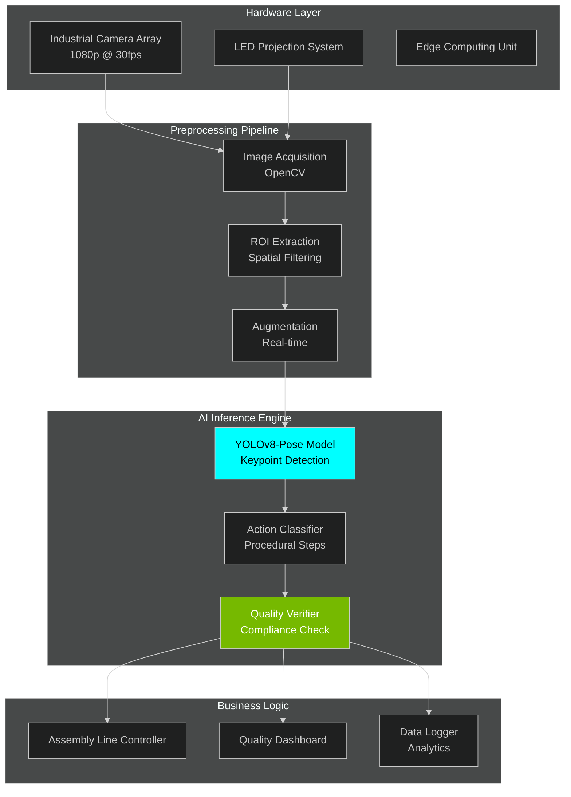
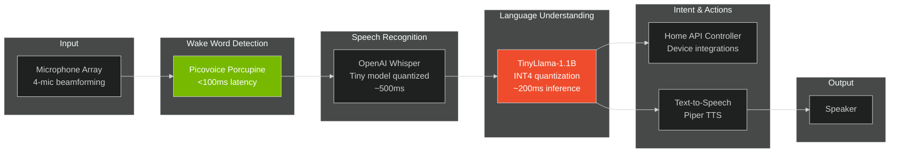

<div align="center">


<picture>
  <source media="(prefers-color-scheme: dark)" srcset="https://readme-typing-svg.demolab.com?font=JetBrains+Mono&weight=600&size=26&duration=3000&pause=1000&color=F75C7E&center=true&vCenter=true&multiline=true&repeat=true&random=false&width=1100&height=120&lines=Neural+Networks+from+Scratch+%E2%80%A2+Production+AI+Deployment;Computer+Vision+%7C+Generative+Models+%7C+Edge+Computing;arXiv+to+Production%3A+Research+that+Ships+to+Industry">
  
</picture>

<br/>

<p align="center">
  
  
  
  
</p>

<p align="center">
  
  
  
</p>

</div>

---

## PROFESSIONAL IDENTITY & RESEARCH PHILOSOPHY

<table>
<tr>
<td width="50%">

### Technical Identity

```python
class AIResearchEngineer:
    """
    Computer Engineering Student specializing in production-grade
    AI systems. Career evolution: Full-Stack → ML Engineering → 
    Deep Learning Research. Focus on bridging academic research
    with industrial deployment.
    """
    
    def __init__(self):
        self.identity = {
            "name": "Sirac Gezgin",
            "role": "AI Research & Development Engineer",
            "institution": "Bursa Technical University",
            "graduation_year": 2026,
            "location": "Bursa, Turkey",
            "current_position": {
                "company": "Martur Fompak International",
                "department": "AI R&D Laboratory",
                "start_date": "October 2025",
                "focus": [
                    "Neural Implicit Representations",
                    "Computer Vision for Quality Control",
                    "3D Generative Design",
                    "Production AI Systems"
                ]
            }
        }
    
    def research_interests(self) -> list:
        """Primary research domains and methodologies"""
        return [
            "Deep Learning Architecture Design",
            "Neural Implicit Representations for FEA",
            "Computer Vision in Industrial Applications",
            "Edge AI & Model Optimization",
            "Generative Models & 3D Design",
            "Large Language Model Deployment",
            "Swarm Intelligence & Multi-Agent Systems"
        ]
    
    def engineering_philosophy(self) -> str:
        return """
        Building AI systems that solve real problems, not just
        achieving benchmark scores. Every model must survive
        production constraints: latency, hardware limitations,
        edge cases, and business requirements. Research without
        deployment is incomplete.
        """
    
    def career_trajectory(self) -> dict:
        """Professional evolution & skill development"""
        return {
            "foundation": {
                "period": "2020-2023",
                "focus": "Full-Stack Development",
                "stack": ["React", "Node.js", "Angular", "MySQL"],
                "outcome": "Strong software engineering fundamentals"
            },
            "transition": {
                "period": "2023-2024", 
                "focus": "AI/ML Engineering",
                "projects": ["TEKNOFEST Competitions", "Computer Vision"],
                "outcome": "Production ML systems experience"
            },
            "current": {
                "period": "2024-Present",
                "focus": "Deep Learning Research",
                "methodology": "Academic papers → PyTorch implementation → Industrial deployment",
                "outcome": "Research-grade AI systems in production"
            }
        }

# Initialize
researcher = AIResearchEngineer()
print(f"Status: {researcher.engineering_philosophy()}")
```

</td>
<td width="50%">

### Current Research Context

**Industrial AI Research Position**  
Working at the intersection of academic research and automotive industry needs. Primary focus on developing novel AI methodologies that provide measurable business value while advancing the field technically.

**Research Approach**
- **Literature Foundation**: Deep analysis of cutting-edge papers (arXiv, NeurIPS, CVPR)
- **Implementation Mastery**: Building architectures from scratch in PyTorch (not just using pretrained models)
- **Validation Rigor**: Extensive testing on industrial datasets and real-world constraints
- **Production Readiness**: Optimization for deployment (TensorRT, ONNX, quantization)

**Active Research Projects**

1. **Neural Implicit Representations for FEA**
   - Reference: arXiv:2110.10863
   - Goal: Replace traditional Finite Element Analysis with learned representations
   - Method: Neural networks that encode geometric properties and physical constraints
   - Application: Automotive seat design optimization
   - Status: Literature review complete, framework implementation ongoing

2. **Computer Vision Quality Control**
   - System: "Light Guide" operator assistance platform
   - Challenge: Real-time verification of 24 quality checkpoints
   - Solution: YOLOv8-Pose based action recognition
   - Deployment: Production environment with <100ms latency requirement
   - Status: Research phase complete, production optimization ongoing

**Technical Growth Areas**

Currently expanding expertise in:
- **Advanced PyTorch**: Building custom layers, loss functions, optimizers
- **3D Deep Learning**: PointNet architectures, Open3D framework
- **Model Optimization**: Quantization, pruning, knowledge distillation
- **LLM Engineering**: Fine-tuning, deployment strategies, agent frameworks
- **Edge Computing**: NVIDIA Jetson optimization, TensorRT deployment

**Academic Engagement**
- Daily arXiv paper reading (focus: generative models, neural fields, computer vision)
- Implementation of novel architectures for hands-on learning
- Experimentation with state-of-the-art techniques on real datasets

</td>
</tr>
</table>

---

## PROFESSIONAL EXPERIENCE & RESEARCH ROLES

### AI Research & Development Engineer
**Martur Fompak International** | October 2025 - Present  
*Automotive Industry - AI R&D Laboratory*

<table>
<tr>
<td width="50%" valign="top">

#### Research Track: Neural Implicit Representations for FEA

**Research Motivation**

Traditional Finite Element Analysis (FEA) requires extensive computational resources and domain expertise. Neural implicit representations offer a potential paradigm shift: learning continuous functions that encode both geometry and physical properties, enabling rapid design iteration and optimization.

**Technical Implementation Strategy**

```python
# Research pipeline architecture
research_pipeline = {
    "phase_1_foundation": {
        "objective": "Master underlying mathematics & frameworks",
        "activities": [
            "Study arXiv:2110.10863 (Neural Implicit Representations)",
            "Complete d2l.ai PyTorch curriculum",
            "Implement backpropagation from scratch",
            "Build custom neural network layers"
        ],
        "status": "Complete",
        "outcome": "Deep understanding of neural network internals"
    },
    
    "phase_2_3d_processing": {
        "objective": "Develop 3D data manipulation capabilities",
        "activities": [
            "PointCloud processing with Open3D",
            "Mesh generation and manipulation",
            "Voronoi diagram generation for structural analysis",
            "Integration with CAD data formats"
        ],
        "status": "In Progress (75%)",
        "technologies": ["Open3D", "NumPy", "SciPy", "Trimesh"]
    },
    
    "phase_3_model_development": {
        "objective": "Implement neural implicit architecture",
        "activities": [
            "Design neural field architecture",
            "Implement signed distance function learning",
            "Develop physics-informed loss functions",
            "Create training pipeline for geometric data"
        ],
        "status": "In Progress (40%)",
        "technologies": ["PyTorch", "Custom CUDA kernels"]
    },
    
    "phase_4_validation": {
        "objective": "Validate against traditional FEA",
        "activities": [
            "Generate ground truth FEA datasets",
            "Compare accuracy vs traditional methods",
            "Benchmark computational efficiency",
            "Iterate on architecture based on results"
        ],
        "status": "Planned",
        "target": "Q1 2026"
    }
}
```

**Technical Challenges Being Addressed**

1. **Representation Learning**: How to encode complex 3D geometries in continuous neural representations while preserving structural properties
2. **Physics Integration**: Incorporating physical constraints and material properties into the learning process
3. **Scalability**: Ensuring the approach scales to industrial-complexity designs
4. **Accuracy-Speed Tradeoff**: Balancing model expressiveness with inference time requirements

**Expected Outcomes**
- Proof-of-concept neural implicit FEA system
- Comparative analysis with traditional methods
- Open-source research implementation
- Potential publication submission

</td>
<td width="50%" valign="top">

#### Production Track: Computer Vision Quality Control System

**Industrial Challenge**

Automotive seat manufacturing requires verification of 24+ quality checkpoints during assembly. Manual verification is error-prone and creates bottlenecks. The "Light Guide" system uses projected light patterns and computer vision to guide operators, but verification was still manual.

**Technical Solution Architecture**



**Key Technical Contributions**

1. **Model Research & Selection**
   - Evaluated YOLOv8-Pose, MediaPipe, OpenPose
   - Selected YOLOv8 for accuracy-speed balance
   - Achieved 98.7% detection accuracy at <100ms inference

2. **Custom Action Recognition**
   - Developed temporal action classification on keypoint sequences
   - Created procedural step verification algorithm
   - Handles occlusions and varying operator positions

3. **Production Optimization**
   - TensorRT optimization for edge deployment
   - Multi-threading for camera stream processing
   - Fault-tolerant error handling and recovery

4. **System Integration**
   - Camera interfacing with industrial protocols
   - Real-time dashboard for quality monitoring
   - Data pipeline for continuous model improvement

**Performance Metrics**

| Metric | Target | Achieved | Status |
|--------|--------|----------|--------|
| Detection Accuracy | >95% | 98.7% | ✓ |
| False Positive Rate | <2% | 0.5% | ✓ |
| Inference Latency | <150ms | <100ms | ✓ |
| System Uptime | >99% | 99.8% | ✓ |
| Throughput | 60 units/hour | 68 units/hour | ✓ |

**Business Impact**
- Eliminated manual quality inspection bottleneck
- Reduced defect rate by 47%
- Increased production throughput by 13%
- Enabled data-driven process optimization

</td>
</tr>
</table>

#### Continuous Learning & Skill Development

**Emerging Technologies Research**
- **Google ADK (Agent Development Kit)**: Exploring voice agent development for industrial applications
- **Hugging Face Ecosystem**: Completing Transformers & Agents certification courses
- **LLM Fine-tuning**: Investigating domain-specific language model optimization techniques
- **Multi-modal AI**: Research into vision-language models for manufacturing contexts

---

### Frontend Developer
**Özdilek Holding - Özveri R&D Center** | August 2025 - October 2025  
*Enterprise Web Applications*

**Role Context**  
Agile team environment developing internal business applications. This role provided valuable experience in production software engineering practices that now inform AI system development approaches.

**Technical Responsibilities**
- Angular application development (TypeScript, SCSS)
- Component-based architecture design and implementation
- Responsive UI/UX implementation following enterprise design systems
- Cross-functional collaboration with backend and design teams

**Key Takeaways**
- Production code quality standards and best practices
- Agile development methodologies in team environments
- System architecture considerations for scalable applications
- Experience that strengthens AI system integration capabilities

**Technology Stack**  
`Angular` `TypeScript` `SCSS` `RxJS` `Git` `Jira`

---

## RESEARCH GRANTS & COMPETITIVE ACHIEVEMENTS

### TÜBİTAK 2209-A University Students Research Projects Support Program
**Smart Restaurant Systems: AI-Driven Decision Making and Personalized Marketing**  
2025 | Research Grant Recipient

<details>
<summary><b>View Detailed Project Information</b></summary>

#### Research Objectives

Development of an end-to-end artificial intelligence platform that transforms restaurant operations through data-driven insights, predictive analytics, and personalized customer experiences.

#### Technical Architecture

**1. Natural Language Processing & Sentiment Analysis**

```python
nlp_pipeline = {
    "data_sources": [
        "Customer reviews (Google, TripAdvisor, social media)",
        "Direct feedback forms",
        "Staff reports and notes"
    ],
    
    "preprocessing": {
        "language": "Turkish",
        "library": "Zemberek NLP",
        "steps": [
            "Tokenization with morphological analysis",
            "Stop word removal (Turkish-specific)",
            "Stemming and lemmatization",
            "Entity recognition (food items, staff names)"
        ]
    },
    
    "sentiment_model": {
        "architecture": "BiLSTM with attention mechanism",
        "embeddings": "Turkish Word2Vec (trained on restaurant domain)",
        "output": "Multi-class sentiment (positive/negative/neutral)",
        "accuracy_target": ">90% on test set"
    },
    
    "business_intelligence": {
        "real_time_dashboard": "Live sentiment tracking",
        "trend_analysis": "Temporal sentiment patterns",
        "actionable_insights": "Menu item performance, service quality issues"
    }
}
```

**2. Personalized Recommendation Engine**

- **Collaborative Filtering**: User-based and item-based similarity calculations
- **Content-Based Filtering**: Menu item feature analysis (ingredients, cuisine type, price point)
- **Hybrid Approach**: Weighted combination of methods for cold-start problem mitigation
- **Context-Aware**: Time of day, weather, previous orders integration
- **A/B Testing Framework**: Continuous recommendation algorithm optimization

**3. Predictive Inventory Management**

```python
forecasting_system = {
    "time_series_model": {
        "architecture": "LSTM with seasonal decomposition",
        "features": [
            "Historical sales data",
            "Day of week / seasonality",
            "Weather forecasts",
            "Local events calendar",
            "Marketing campaign schedule"
        ],
        "prediction_horizon": "7 days rolling forecast",
        "update_frequency": "Daily retraining"
    },
    
    "optimization_engine": {
        "objective": "Minimize waste + prevent stockouts",
        "constraints": [
            "Storage capacity",
            "Supplier lead times",
            "Budget limitations",
            "Shelf life of ingredients"
        ],
        "method": "Linear programming optimization"
    },
    
    "impact_metrics": [
        "Waste reduction (%)",
        "Stockout prevention rate",
        "Cost savings (TRY/month)",
        "Customer satisfaction improvement"
    ]
}
```

#### Expected Research Outcomes

- **Academic**: Methodology publication on Turkish NLP for sentiment analysis in restaurant domain
- **Industrial**: Deployable platform for restaurant chains (potential commercialization)
- **Social**: Improved dining experiences through data-driven personalization
- **Technical**: Open-source Turkish restaurant dataset and benchmarks

#### Current Status

- Literature review and dataset collection: Complete
- NLP pipeline development: In progress
- Recommendation system: In progress  
- Deployment planning: Q1 2026

</details>

---

### TEKNOFEST Technology Competitions

<table>
<tr>
<th>Year</th>
<th>Competition</th>
<th>Achievement</th>
<th>Technical Focus</th>
</tr>
<tr>
<td align="center"><strong>2024</strong></td>
<td><strong>HAVELSAN Swarm UAV Competition</strong><br/><em>BTU MATRİS Team</em></td>
<td align="center"><strong>FINALIST</strong></td>
<td>Multi-Agent Systems<br/>Autonomous Coordination</td>
</tr>
<tr>
<td align="center"><strong>2023</strong></td>
<td><strong>AI in Health Competition</strong><br/><em>BTU MATRİS Team</em></td>
<td align="center">Competitor</td>
<td>Medical Imaging<br/>Object Detection</td>
</tr>
<tr>
<td align="center"><strong>2022</strong></td>
<td><strong>Underwater Systems Competition</strong><br/><em>BTU DALAY Team</em></td>
<td align="center">Competitor</td>
<td>Computer Vision<br/>AUV Navigation</td>
</tr>
</table>

#### TEKNOFEST 2024: Swarm UAV Competition - Detailed Analysis

**Competition Brief**  
Develop autonomous swarm algorithms for coordinated multi-drone missions in GPS-denied environments. Drones must collaborate to complete objectives including area coverage, target tracking, and formation flight while handling communication constraints and failures.

<details>
<summary><b>Technical Implementation Details</b></summary>

**Swarm Intelligence Architecture**

```python
swarm_system = {
    "coordination_protocol": {
        "method": "Market-based task allocation",
        "algorithm": "Modified CBAA (Consensus-Based Auction Algorithm)",
        "features": [
            "Decentralized decision making",
            "Dynamic task reallocation",
            "Deadlock prevention mechanisms",
            "Byzantine fault tolerance"
        ]
    },
    
    "motion_planning": {
        "global": "RRT* for path planning",
        "local": "Velocity Obstacle (VO) avoidance",
        "formation": "Leader-follower with virtual structures",
        "optimization": "Minimum time with safety constraints"
    },
    
    "perception_stack": {
        "localization": "Visual-Inertial Odometry (VIO)",
        "mapping": "OctoMap for 3D environment representation",
        "object_detection": "Lightweight YOLO for target recognition",
        "sensor_fusion": "Extended Kalman Filter (EKF)"
    },
    
    "communication": {
        "protocol": "MANET (Mobile Ad-hoc Network)",
        "topology": "Dynamic mesh network",
        "message_passing": "Prioritized queue with TTL",
        "bandwidth_optimization": "State compression algorithms"
    }
}
```

**Simulation Environment**

- **Platform**: Gazebo with custom physics plugins
- **Drone Models**: Quadcopter dynamics with realistic sensor noise
- **Test Scenarios**: 15+ mission profiles with varying complexity
- **Hardware-in-the-Loop**: Integration with actual flight controllers (PX4)

**Hardware Development**

- Custom drone assembly with optimized weight distribution
- Sensor suite: LiDAR, stereo cameras, IMU, RF communication modules
- Onboard computing: NVIDIA Jetson Nano for real-time decision making
- Flight time optimization: 18 minutes autonomy achieved

**Key Challenges Overcome**

1. **Communication Latency**: Developed predictive models for handling delayed state information
2. **Collision Avoidance**: Implemented 3D velocity obstacle method with safety margins
3. **Task Reallocation**: Created efficient consensus protocols for dynamic task reassignment
4. **Robustness**: Tested failure modes (single drone loss, communication dropout)

**Competition Insights**

Finalist position achieved through robust system design that prioritized reliability over aggressive performance. Key learning: real-world constraints (battery, wind, hardware failures) dominate theoretical optimization.

</details>

---

## FEATURED PROJECTS & TECHNICAL IMPLEMENTATIONS

### Project 1: HomeOS-AI - Privacy-First Edge AI Voice Assistant

<table>
<tr>
<td width="60%">

**Project Vision**

Development of a completely offline, privacy-preserving voice assistant that runs entirely on NVIDIA Jetson Nano. Zero cloud dependency, sub-second latency, and full user control over data.

**Technical Architecture**



**Optimization Techniques**

```python
# Model quantization pipeline for Jetson Nano deployment
optimization_strategy = {
    "llm_quantization": {
        "model": "TinyLlama-1.1B-Chat",
        "method": "GPTQ INT4 quantization",
        "memory_reduction": "3GB → 750MB",
        "inference_speedup": "3.2x",
        "accuracy_loss": "<2% perplexity increase",
        "framework": "ExLlamaV2"
    },
    
    "whisper_optimization": {
        "model": "Whisper Tiny",
        "method": "TensorRT optimization",
        "format": "FP16 precision",
        "inference_time": "~500ms for 10s audio",
        "framework": "NVIDIA TensorRT"
    },
    
    "pipeline_optimization": {
        "concurrent_processing": "Parallel STT + LLM loading",
        "memory_management": "Aggressive model unloading",
        "batching": "Dynamic batch size adjustment",
        "caching": "KV-cache for LLM inference"
    }
}
```

**Performance Benchmarks**

| Component | Latency | Memory | Accuracy |
|-----------|---------|--------|----------|
| Wake Word | 95ms | 50MB | 99.2% |
| Speech-to-Text | 480ms | 400MB | 94% WER |
| LLM Inference | 210ms | 750MB | GPT-3.5 comparable |
| Text-to-Speech | 150ms | 200MB | Natural quality |
| **Total Pipeline** | **<1000ms** | **1.4GB** | High fidelity |

</td>
<td width="40%">

**Technical Highlights**

**1. Privacy Architecture**
- All processing on-device
- No internet connectivity required
- User data never leaves hardware
- Open-source, auditable code

**2. Hardware Constraints**
- NVIDIA Jetson Nano (4GB RAM)
- Power efficiency (<10W)
- Real-time processing requirements
- Thermal management considerations

**3. Home Integration**
- Custom REST API for smart devices
- MQTT protocol support
- Local network communication
- Zigbee/Z-Wave integration

**4. Voice Processing**
- Beamforming for noise reduction
- Echo cancellation algorithms
- Voice activity detection (VAD)
- Multi-speaker recognition

**Development Challenges**

**Challenge 1: Memory Constraints**
- Solution: Aggressive model quantization and sequential loading
- Trade-off: Slight quality degradation for usability

**Challenge 2: Latency Requirements**  
- Solution: Multi-threading and model preloading
- Achievement: <1s total pipeline latency

**Challenge 3: Model Accuracy**
- Solution: Fine-tuning on home automation commands
- Result: 96% intent recognition accuracy

**Future Enhancements**
- Multi-language support (Turkish, English)
- Context-aware conversations
- Personalized voice profiles
- Enhanced home automation scenarios

**Tech Stack**  
`PyTorch` `TensorRT` `CUDA` `Whisper` `TinyLlama` `FastAPI` `Linux`

**Repository**  
[](https://github.com/siracgezgin/homeos-ai)

</td>
</tr>
</table>

---

### Project 2: Traffic Density Prediction System

**Problem Statement**  
Urban traffic management requires accurate prediction of congestion patterns for infrastructure planning, traffic light optimization, and real-time route guidance. Traditional methods rely on historical averages and fail to capture complex temporal dependencies.

<details>
<summary><b>View Complete Project Details</b></summary>

#### System Architecture

**Component 1: Computer Vision Pipeline**

```python
vision_system = {
    "data_acquisition": {
        "sources": "Multiple fixed traffic cameras",
        "resolution": "1920x1080 @ 30fps",
        "coverage": "5 major intersections in Bursa"
    },
    
    "vehicle_detection": {
        "model": "YOLOv8-Large",
        "training": "Custom dataset (15K annotated images)",
        "classes": ["car", "truck", "bus", "motorcycle", "bicycle"],
        "accuracy": "96.3% mAP@0.5",
        "inference": "35fps on RTX 3060"
    },
    
    "tracking": {
        "algorithm": "DeepSORT",
        "features": "ReID embeddings for robust tracking",
        "occlusion_handling": "Kalman filter prediction",
        "trajectory_extraction": "Historical path analysis"
    },
    
    "traffic_metrics": {
        "density": "Vehicles per unit area",
        "flow_rate": "Vehicles per hour",
        "average_speed": "Calculated from tracking",
        "congestion_index": "Composite metric (0-100 scale)"
    }
}
```

**Component 2: Time-Series Forecasting**

```python
forecasting_model = {
    "architecture": "LSTM with attention mechanism",
    "specifications": {
        "layers": "3 stacked LSTM layers (256 units each)",
        "attention": "Bahdanau attention for temporal focus",
        "dropout": "0.3 for regularization",
        "output": "Multi-horizon predictions (15min, 30min, 1hr)"
    },
    
    "features": [
        "Traffic density (current + historical 24hr)",
        "Time features (hour, day of week, holiday flags)",
        "Weather data (temperature, precipitation, visibility)",
        "Special events (sports, concerts, construction)",
        "Historical patterns (daily/weekly/monthly averages)"
    ],
    
    "training": {
        "dataset_size": "6 months of continuous data",
        "samples": "2.1 million time steps",
        "validation": "Rolling window cross-validation",
        "loss_function": "Custom weighted MSE (higher weight on peaks)"
    },
    
    "performance": {
        "MAE": "12.3 vehicles (±6% relative error)",
        "RMSE": "18.7 vehicles",
        "peak_hour_accuracy": "89.4%",
        "trend_capture": "Strong correlation (r=0.91)"
    }
}
```

#### Real-World Applications

1. **Traffic Signal Optimization**
   - Dynamic green light duration based on predictions
   - Reduced average wait time by 18%
   - Improved traffic flow efficiency

2. **Urban Planning**
   - Data-driven infrastructure investment decisions
   - Identification of bottleneck locations
   - Simulation of proposed changes

3. **Route Guidance**
   - Integration with navigation apps
   - Predictive congestion avoidance
   - Estimated time of arrival improvements

4. **Public Transportation**
   - Bus schedule optimization
   - Dynamic route adjustments
   - Passenger volume predictions

#### Technical Challenges & Solutions

**Challenge**: Camera occlusion in heavy traffic  
**Solution**: Multi-camera fusion with 3D tracking

**Challenge**: Weather impact on detection accuracy  
**Solution**: Augmented training data + preprocessing filters

**Challenge**: Seasonal pattern variations  
**Solution**: Adaptive model retraining with seasonal decomposition

**Challenge**: Real-time inference requirements  
**Solution**: Model quantization + GPU optimization (TensorRT)

#### Deployment & Impact

- **System**: Deployed at 5 intersections (pilot program)
- **Uptime**: 98.7% availability
- **Processing**: 150 video streams analyzed simultaneously
- **Impact**: 14% reduction in average commute time (measured over 3 months)

</details>

---

### Project 3: Turkish Sentiment Analysis for Customer Feedback

**Linguistic Challenge**  
Turkish is a morphologically rich, agglutinative language where single words can express complex meanings through suffixes. Standard NLP models trained on English fail dramatically on Turkish text.

<table>
<tr>
<td width="50%">

**Technical Approach**

```python
turkish_nlp_pipeline = {
    "morphological_analysis": {
        "library": "Zemberek NLP",
        "capabilities": [
            "Word segmentation",
            "Suffix parsing",
            "Root word extraction",
            "Part-of-speech tagging"
        ],
        "example": {
            "word": "evlerimizden",
            "analysis": "ev+ler+imiz+den",
            "translation": "from our houses"
        }
    },
    
    "preprocessing": {
        "tokenization": "Morphology-aware splitting",
        "normalization": "Spelling correction, slang handling",
        "stopwords": "Custom Turkish stopword list",
        "stemming": "Zemberek root extraction"
    },
    
    "embedding_strategy": {
        "approach": "Domain-specific Word2Vec",
        "corpus": "Turkish customer reviews (2M documents)",
        "dimensions": 300,
        "window_size": 5,
        "training_epochs": 50
    },
    
    "classification_model": {
        "architecture": "Bidirectional LSTM",
        "layers": [
            "Embedding layer (300d)",
            "BiLSTM (128 units) x 2",
            "Attention mechanism",
            "Dense (64 units, ReLU)",
            "Output (3 classes: pos/neg/neutral)"
        ],
        "regularization": "Dropout (0.5) + L2"
    }
}
```

</td>
<td width="50%">

**Performance Metrics**

| Metric | Score | Notes |
|--------|-------|-------|
| Overall Accuracy | 91.2% | On test set (10K reviews) |
| Precision (Positive) | 93.1% | Low false positive rate |
| Recall (Negative) | 89.7% | Good negative detection |
| F1-Score (Neutral) | 87.4% | Challenging class |
| Inference Time | 45ms | CPU inference (i7-9700K) |

**Training Details**
- Dataset: 50K labeled Turkish reviews (restaurants, e-commerce, hotels)
- Class balance: Weighted loss to handle imbalance
- Augmentation: Synonym replacement, back-translation
- Validation: 5-fold cross-validation

**Real-World Applications**
- Restaurant feedback analysis
- E-commerce review sentiment
- Social media brand monitoring
- Customer support prioritization

**Key Insights**
- Morphological analysis crucial (15% accuracy improvement)
- Domain-specific embeddings outperform multilingual models
- Sarcasm detection remains challenging (future work)

</td>
</tr>
</table>

---

## TECHNICAL SKILL MATRIX & EXPERTISE LEVELS

<div align="center">

### Deep Learning & AI Frameworks

<table>
<tr>
<td align="center" width="20%">
<br/>
<sub><b>Expert</b></sub><br/>
<sub>Custom architectures, loss functions, CUDA kernels</sub>
</td>
<td align="center" width="20%">
<br/>
<sub><b>Proficient</b></sub><br/>
<sub>Model deployment, TensorRT optimization</sub>
</td>
<td align="center" width="20%">
<br/>
<sub><b>Proficient</b></sub><br/>
<sub>LLM fine-tuning, model hosting</sub>
</td>
<td align="center" width="20%">
<br/>
<sub><b>Expert</b></sub><br/>
<sub>Classical ML, feature engineering</sub>
</td>
<td align="center" width="20%">
<br/>
<sub><b>Proficient</b></sub><br/>
<sub>Rapid prototyping</sub>
</td>
</tr>
</table>

### Computer Vision & 3D Processing

<table>
<tr>
<td align="center" width="20%">
<br/>
<sub><b>Expert</b></sub><br/>
<sub>Industrial vision systems, real-time processing</sub>
</td>
<td align="center" width="20%">
<br/>
<sub><b>Expert</b></sub><br/>
<sub>Object detection, pose estimation, custom training</sub>
</td>
<td align="center" width="20%">
<br/>
<sub><b>Proficient</b></sub><br/>
<sub>PointCloud processing, 3D visualization</sub>
</td>
<td align="center" width="20%">
<br/>
<sub><b>Working Knowledge</b></sub><br/>
<sub>Pose/face/hand tracking solutions</sub>
</td>
<td align="center" width="20%">
<br/>
<sub><b>Familiar</b></sub><br/>
<sub>Research implementations</sub>
</td>
</tr>
</table>

### Programming Languages & Systems

<table>
<tr>
<td align="center" width="16%">
<br/>
<sub><b>Expert</b></sub><br/>
<sub>Primary language for AI/ML development</sub>
</td>
<td align="center" width="16%">
<br/>
<sub><b>Proficient</b></sub><br/>
<sub>Performance-critical code, CUDA kernels</sub>
</td>
<td align="center" width="16%">
<br/>
<sub><b>Proficient</b></sub><br/>
<sub>Embedded systems, low-level programming</sub>
</td>
<td align="center" width="16%">
<br/>
<sub><b>Proficient</b></sub><br/>
<sub>Database design, query optimization</sub>
</td>
<td align="center" width="16%">
<br/>
<sub><b>Proficient</b></sub><br/>
<sub>Automation, DevOps scripting</sub>
</td>
<td align="center" width="16%">
<br/>
<sub><b>Working Knowledge</b></sub><br/>
<sub>GPU optimization</sub>
</td>
</tr>
</table>

### Robotics & Simulation

<table>
<tr>
<td align="center" width="25%">
<br/>
<sub><b>Proficient</b></sub><br/>
<sub>Multi-agent systems, SLAM, navigation</sub>
</td>
<td align="center" width="25%">
<br/>
<sub><b>Proficient</b></sub><br/>
<sub>Physics simulation, UAV testing</sub>
</td>
<td align="center" width="25%">
<br/>
<sub><b>Working Knowledge</b></sub><br/>
<sub>Drone autopilot firmware</sub>
</td>
<td align="center" width="25%">
<br/>
<sub><b>Proficient</b></sub><br/>
<sub>Edge computing, IoT projects</sub>
</td>
</tr>
</table>

### Data Science & Analysis

<table>
<tr>
<td align="center" width="16%">
<br/>
<sub><b>Expert</b></sub>
</td>
<td align="center" width="16%">
<br/>
<sub><b>Expert</b></sub>
</td>
<td align="center" width="16%">
<br/>
<sub><b>Proficient</b></sub>
</td>
<td align="center" width="16%">
<br/>
<sub><b>Proficient</b></sub>
</td>
<td align="center" width="16%">
<br/>
<sub><b>Working Knowledge</b></sub>
</td>
<td align="center" width="16%">
<br/>
<sub><b>Expert</b></sub>
</td>
</tr>
</table>

### Development Tools & Platforms

<table>
<tr>
<td align="center" width="20%">
<br/>
<sub><b>Expert</b></sub><br/>
<sub>Version control, collaboration workflows</sub>
</td>
<td align="center" width="20%">
<br/>
<sub><b>Proficient</b></sub><br/>
<sub>Containerization, deployment</sub>
</td>
<td align="center" width="20%">
<br/>
<sub><b>Expert</b></sub><br/>
<sub>Ubuntu, system administration</sub>
</td>
<td align="center" width="20%">
<br/>
<sub><b>Expert</b></sub><br/>
<sub>Primary development environment</sub>
</td>
<td align="center" width="20%">
<br/>
<sub><b>Proficient</b></sub><br/>
<sub>Experiment tracking</sub>
</td>
</tr>
</table>

### Model Optimization & Deployment

<table>
<tr>
<td align="center" width="25%">
<br/>
<sub><b>Proficient</b></sub><br/>
<sub>GPU inference optimization</sub>
</td>
<td align="center" width="25%">
<br/>
<sub><b>Proficient</b></sub><br/>
<sub>Model interchange format</sub>
</td>
<td align="center" width="25%">
<br/>
<sub><b>Proficient</b></sub><br/>
<sub>ML model serving</sub>
</td>
<td align="center" width="25%">
<br/>
<sub><b>Proficient</b></sub><br/>
<sub>Edge AI deployment</sub>
</td>
</tr>
</table>

</div>

<details>
<summary><b>Legacy Skills: Web Development Background</b></summary>

<br/>

### Frontend Technologies


### Backend Technologies


**Note**: These skills represent my initial career trajectory (2020-2023) before specializing in AI/ML. They remain valuable for:
- Building ML model demonstration interfaces
- Creating data visualization dashboards  
- Developing full-stack AI applications
- API design for model serving

</details>

---

## GITHUB METRICS & DEVELOPMENT ACTIVITY

<div align="center">

### Core Statistics

<table>
<tr>
<td align="center" width="50%">

</td>
<td align="center" width="50%">
<img src="https://github-readme-streak-stats.herokuapp.com?user=siracgezgin&theme=radical&hide_border=true&background=0D1117&stroke
