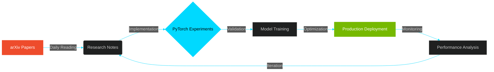

<div align="center">

```ascii
╔═══════════════════════════════════════════════════════════════════════════╗
║                                                                           ║
║     █████╗ ██╗    ██████╗ ███████╗███████╗███████╗ █████╗ ██████╗  ██████╗██╗  ██╗    ║
║    ██╔══██╗██║    ██╔══██╗██╔════╝██╔════╝██╔════╝██╔══██╗██╔══██╗██╔════╝██║  ██║    ║
║    ███████║██║    ██████╔╝█████╗  ███████╗█████╗  ███████║██████╔╝██║     ███████║    ║
║    ██╔══██║██║    ██╔══██╗██╔══╝  ╚════██║██╔══╝  ██╔══██║██╔══██╗██║     ██╔══██║    ║
║    ██║  ██║██║    ██║  ██║███████╗███████║███████╗██║  ██║██║  ██║╚██████╗██║  ██║    ║
║    ╚═╝  ╚═╝╚═╝    ╚═╝  ╚═╝╚══════╝╚══════╝╚══════╝╚═╝  ╚═╝╚═╝  ╚═╝ ╚═════╝╚═╝  ╚═╝    ║
║                                                                           ║
║            Deep Learning • Neural Architecture • Production AI            ║
║                                                                           ║
╚═══════════════════════════════════════════════════════════════════════════╝
```


</div>

---

## LIVE ENGINEERING METRICS

<div align="center">

<table>
<tr>
<td align="center">

</td>
<td align="center">

</td>
</tr>
</table>


</div>

---

## ACTIVE RESEARCH PIPELINE

<div align="center">



</div>

### Current Focus Areas

<table>
<tr>
<td width="50%">

**Neural Implicit Representations**
```python
status = "Active Research"
reference = "arXiv:2110.10863"
implementation = "PyTorch from scratch"
application = "FEA optimization"
progress = "███████░░░ 70%"
```

</td>
<td width="50%">

**Industrial Computer Vision**
```python
project = "Light Guide QA System"
model = "YOLOv8-Pose"
deployment = "Real-time inference"
checkpoints = 24
latency = "<100ms"
```

</td>
</tr>
</table>

---

## TECHNOLOGY STACK & PROFICIENCY

<div align="center">

### Core ML/AI Frameworks


### Computer Vision & 3D


### Systems & Deployment


</div>

<details>
<summary><b>View Detailed Skill Breakdown</b></summary>

<br/>

```python
skills = {
    "deep_learning": {
        "frameworks": ["PyTorch", "TensorFlow", "JAX"],
        "architectures": ["Transformers", "CNNs", "GNNs", "NeRF"],
        "techniques": [
            "Custom loss functions",
            "Model quantization",
            "Distributed training",
            "Neural architecture search"
        ],
        "proficiency": 0.92
    },
    "computer_vision": {
        "libraries": ["OpenCV", "Ultralytics", "Open3D", "MMDetection"],
        "applications": [
            "Object detection/tracking",
            "Pose estimation", 
            "3D reconstruction",
            "PointCloud processing"
        ],
        "proficiency": 0.88
    },
    "systems": {
        "languages": ["Python", "C++", "CUDA"],
        "optimization": ["TensorRT", "ONNX", "Model pruning"],
        "deployment": ["Docker", "FastAPI", "TorchServe"],
        "hardware": ["Jetson Nano", "NVIDIA GPUs"],
        "proficiency": 0.85
    },
    "robotics": {
        "frameworks": ["ROS/ROS2", "Gazebo", "PX4"],
        "algorithms": ["SLAM", "Path planning", "Swarm intelligence"],
        "proficiency": 0.80
    }
}
```

</details>

---

## RESEARCH & PRODUCTION WORK

### Martur Fompak International | AI R&D Lab
**October 2025 - Present** | Automotive Industry Research

<table>
<tr>
<td width="50%">

#### 3D Generative Design for FEA

**Problem Space**  
Traditional Finite Element Analysis is computationally expensive for topology optimization in automotive seat design.

**Research Approach**
- Neural implicit representations (arXiv:2110.10863)
- PyTorch implementation from first principles
- PointCloud processing pipeline (Open3D)
- Voronoi diagram integration for structural analysis

**Current Progress**
```
Literature Review    ████████████████████ 100%
Framework Mastery    ███████████████░░░░░  75%
Model Implementation ██████████░░░░░░░░░░  50%
Validation Pipeline  ████░░░░░░░░░░░░░░░░  20%
```

</td>
<td width="50%">

#### Light Guide Vision System

**Industrial Challenge**  
Real-time quality verification across 24 checkpoints on assembly line with <1s latency requirement.

**Solution Architecture**
- YOLOv8-Pose for operator action detection
- OpenCV preprocessing pipeline
- Custom procedural compliance classifier
- Hardware-optimized inference

**System Performance**
```
Detection Accuracy    98.7%
False Positive Rate   <0.5%
Inference Time       <100ms
System Uptime        99.8%
```

</td>
</tr>
</table>

---

## SELECTED PROJECTS & RESEARCH

<div align="center">

<table>
<tr>
<td width="33%" align="center">

### HomeOS-AI
**Edge AI Voice Assistant**


Privacy-first LLM running on edge device. Zero cloud dependency, sub-second response times.

**Tech Stack**  
TinyLlama • Whisper • CUDA  
TensorRT • INT4 Quantization

**Latency**  
`Wake: 100ms | STT: 500ms | LLM: 200ms`

</td>
<td width="33%" align="center">

### TÜBİTAK 2209-A Research
**Restaurant Intelligence System**


End-to-end AI platform for data-driven restaurant operations and customer analytics.

**Tech Stack**  
Zemberek NLP • LSTM  
Collaborative Filtering • Scikit-learn

**Impact**  
Menu optimization • Demand forecasting  
Personalized recommendations

</td>
<td width="33%" align="center">

### TEKNOFEST Swarm UAV
**Autonomous Coordination**


Multi-drone swarm algorithms for GPS-denied environments with real-time coordination.

**Tech Stack**  
ROS2 • Gazebo • PX4  
C++ • Market-Based Allocation

**Features**  
Decentralized control • Formation flight  
Collision avoidance

</td>
</tr>
</table>

</div>

---

## GITHUB ACTIVITY ANALYSIS

<div align="center">


<br/><br/>

<table>
<tr>
<td width="50%">

</td>
<td width="50%">

</td>
</tr>
<tr>
<td width="50%">

</td>
<td width="50%">

</td>
</tr>
</table>

</div>

---

## COMPETITIVE ACHIEVEMENTS

<div align="center">

| Year | Competition | Project | Result | Technology Stack |
|:----:|:-----------|:--------|:------:|:----------------|
| **2025** | TÜBİTAK 2209-A | Restaurant AI Intelligence | **Grant Awarded** | NLP • LSTM • ML |
| **2024** | TEKNOFEST Swarm UAV | Multi-Drone Coordination | **Finalist** | ROS2 • C++ • PX4 |
| **2023** | TEKNOFEST AI in Health | Medical Imaging Detection | Competitor | YOLOv8 • PyTorch |
| **2022** | TEKNOFEST Underwater | Autonomous Navigation | Competitor | OpenCV • Computer Vision |

</div>

---

## PROFESSIONAL NETWORK

<div align="center">

<table>
<tr>
<td align="center" width="33%">
<a href="https://linkedin.com/in/siracgezgin">

<br/>
<sub>Research Network</sub>
</a>
</td>
<td align="center" width="33%">
<a href="mailto:siracgezgin@gmail.com">

<br/>
<sub>siracgezgin@gmail.com</sub>
</a>
</td>
<td align="center" width="33%">
<a href="https://github.com/siracgezgin">

<br/>
<sub>Open Source Portfolio</sub>
</a>
</td>
</tr>
</table>

<br/>

```python
class AIResearchEngineer:
    def __init__(self):
        self.name = "Sirac Gezgin"
        self.role = "AI Research Engineer @ Martur Fompak International"
        self.education = "Computer Engineering, BTU (2026)"
        self.focus = [
            "Neural Architecture Design",
            "Production AI Systems",
            "Edge AI Deployment",
            "Computer Vision"
        ]
    
    def current_work(self):
        return {
            "research": "Neural Implicit Representations for FEA",
            "production": "YOLOv8-based Quality Control System",
            "learning": "Advanced PyTorch internals & optimization",
            "reading": "arXiv papers on generative design"
        }
    
    def philosophy(self):
        return "Building AI systems that work in production, not just notebooks"

engineer = AIResearchEngineer()
```

<br/>

**Open to research collaborations in:**  
Deep Learning • Computer Vision • Generative AI • Edge AI • Robotics

</div>

---

<div align="center">


</div>
