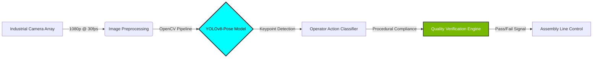
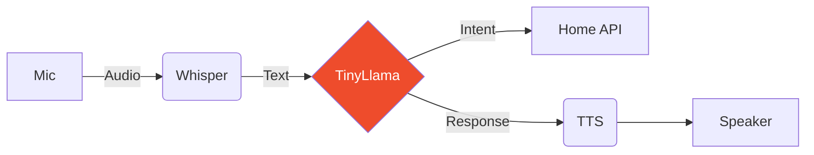
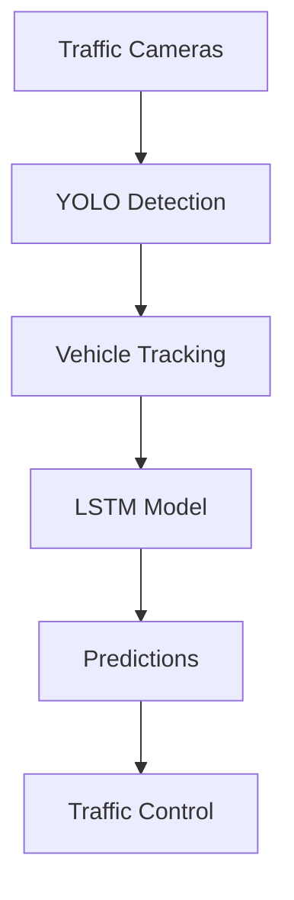

<div align="center">

<!-- Advanced Header -->


<!-- Multi-Line Typing Animation -->
<picture>
  <source media="(prefers-color-scheme: dark)" srcset="https://readme-typing-svg.demolab.com?font=JetBrains+Mono&weight=700&size=28&duration=3500&pause=800&color=F75C7E&center=true&vCenter=true&multiline=true&repeat=true&random=false&width=1000&height=140&lines=Deep+Learning+%E2%80%A2+Computer+Vision+%E2%80%A2+Generative+AI;Neural+Implicit+Representations+%7C+Edge+AI+Deployment;From+Full-Stack+to+AI+Research%3A+Building+Intelligence">
  
</picture>

<br/>

<!-- Profile Metrics -->
<p>
  
  
  
  
</p>

<p>
  
  
  
</p>

</div>

---

## TECHNICAL IDENTITY

```python
class AIResearchEngineer:
    """
    Senior Computer Engineering student specializing in the convergence of 
    geometric deep learning, generative design, and autonomous systems.
    Career trajectory: Full-Stack Development → AI/ML Research Engineering
    """
    
    def __init__(self):
        self.identity = {
            "name": "Sirac Gezgin",
            "location": "Bursa, Turkey",
            "institution": "Bursa Technical University",
            "graduation": 2026,
            "current_role": "AI R&D Intern @ Martur Fompak International",
            "research_focus": [
                "3D Generative Design & FEA",
                "Neural Implicit Representations",
                "Computer Vision for Industrial QA",
                "Edge AI & LLM Deployment"
            ]
        }
        
    def current_research(self) -> dict:
        """Active research at Martur Fompak International AI R&D Lab"""
        return {
            "project": "Neural Implicit Representations for Finite Element Analysis",
            "reference": "arXiv:2110.10863",
            "methodology": [
                "Deep Learning architectures from scratch (PyTorch)",
                "PointCloud Processing & Topology Optimization",
                "Voronoi Diagrams for structural analysis",
                "Open3D framework for 3D data manipulation"
            ],
            "industrial_application": {
                "domain": "Automotive Quality Control",
                "system": "Light Guide Vision System",
                "technology": "YOLOv8-Pose for operator tracking",
                "scale": "24 quality checkpoints, real-time inference"
            }
        }
    
    def philosophy(self) -> str:
        return """
        Bridging theoretical AI research with production-grade engineering.
        Transforming complex mathematical models into deployed, real-world systems.
        From academic papers (arXiv) to industrial applications (automotive, robotics).
        """

# Initialize
researcher = AIResearchEngineer()
print(researcher.philosophy())
```

**Career Narrative:** Deliberately pivoting from full-stack web development (React, Node.js, Angular) to specialized AI research. Leveraging strong software engineering fundamentals to build robust, production-ready machine learning systems. Not just a model trainer—a systems architect who understands the full pipeline from data to deployment.

---

## RESEARCH & PROFESSIONAL EXPERIENCE

### **Martur Fompak International** | *AI Research & Development*
**October 2025 - Present** | Bursa, Turkey

#### **3D Generative Design for FEA Applications**

**Research Objective:** Investigate neural implicit representations as computationally efficient alternatives to traditional Finite Element Analysis in structural optimization.

**Technical Implementation:**
- **Literature Foundation:** Deep dive into arXiv:2110.10863 on neural implicit fields
- **Framework Mastery:** Implementing core PyTorch components via d2l.ai curriculum
  - Custom backpropagation engines
  - Neural network architectures from scratch
  - Gradient descent optimization algorithms
- **3D Data Pipeline:**
  - PointCloud processing with Open3D
  - Topology optimization workflows
  - Voronoi diagram generation for structural analysis
  - Integration with FEA simulation data

**Key Technologies:** `PyTorch` `Open3D` `NumPy` `PointNet` `Neural Radiance Fields`

---

#### **Computer Vision - "Light Guide" Quality Control System**

**Industrial Challenge:** Real-time verification of 24+ quality checkpoints on automotive seat assembly lines with sub-second latency requirements.

**Solution Architecture:**


**Technical Contributions:**
- Pose estimation model research & evaluation (YOLOv8 architecture)
- Real-time inference optimization for industrial hardware
- Camera interfacing and image processing pipelines (OpenCV)
- Operator movement analysis algorithms for 24 quality checks

**Impact:** Automated quality assurance replacing manual inspection, reducing human error and increasing throughput.

---

#### **Emerging AI Research**

**Continuous Learning:** Monitoring cutting-edge AI developments
- Google ADK (Agent Development Kit) for voice agents
- Hugging Face Transformers & Agents certification courses
- LLM fine-tuning techniques for domain-specific applications

---

### **Özdilek Holding** | *Frontend Development*
**August 2025 - October 2025** | Özveri R&D Center

**Role Context:** Agile team collaboration on internal web applications

**Technical Stack:**
- Angular (TypeScript, SCSS)
- Modular UI component architecture
- Responsive design implementation
- UI/UX standards adherence

**Key Outcome:** Experience in production software development lifecycle, reinforcing engineering discipline applied now to AI systems.

---

## FEATURED PROJECTS

<table>
<tr>
<td width="50%" valign="top">

### **HomeOS-AI**
**Edge AI Voice Assistant | 2025**

[](https://github.com/siracgezgin/homeos-ai)
[](https://github.com/siracgezgin/homeos-ai)
[](https://github.com/siracgezgin/homeos-ai)

Privacy-first voice assistant running entirely on Jetson Nano. Zero cloud dependency, sub-second response times through aggressive model quantization and CUDA optimization.

**System Architecture:**


**Performance:**
- Wake word: <100ms
- Speech-to-text: ~500ms
- LLM inference: ~200ms
- Total latency: <1s

**Optimization Techniques:**
```python
# INT4 quantization pipeline
model = load_quantized_model(
    "TinyLlama-1.1B-Chat",
    quantization="int4",  # 3GB → 750MB
    device="cuda:0"
)
```

**Stack:** `PyTorch` `CUDA` `TensorRT` `Jetson Nano`

</td>
<td width="50%" valign="top">

### **TÜBİTAK 2209-A Research**
**AI-Driven Restaurant Intelligence | 2025**

[](https://github.com/siracgezgin)
[](https://github.com/siracgezgin)
[](https://github.com/siracgezgin)

End-to-end AI system transforming restaurant operations through sentiment analysis, personalized recommendations, and predictive inventory management.

**Technical Pipeline:**

1. **NLP Sentiment Analysis**
   - Turkish language processing (Zemberek)
   - Multi-source feedback aggregation
   - Real-time marketing dashboard

2. **Recommendation Engine**
   - Collaborative filtering
   - Customer clustering
   - A/B testing framework

3. **Predictive Analytics**
   - LSTM time-series forecasting
   - Seasonal pattern recognition
   - Stock optimization algorithms

**Business Impact:**
- Data-driven menu optimization
- Reduced waste through demand prediction
- Personalized customer experiences

**Stack:** `Scikit-learn` `Pandas` `Zemberek` `LSTM`

</td>
</tr>
<tr>
<td width="50%" valign="top">

### **TEKNOFEST Swarm UAV**
**BTU MATRİS Team | Finalist 2024**

[](https://github.com/siracgezgin)
[](https://github.com/siracgezgin)

Autonomous swarm algorithms for coordinated multi-drone operations in GPS-denied environments. Full simulation and hardware deployment.

**Technical Solutions:**
- Decentralized decision protocols
- Market-based task allocation
- Velocity obstacle avoidance
- Formation control algorithms

**Simulation Stack:**
```yaml
Environment: Gazebo (Full Physics)
Framework: ROS/ROS2 Node Architecture
Sensors: LiDAR, IMU, Cameras
Testing: Hardware-in-the-Loop (HITL)
```

**Hardware:**
- Custom drone assembly
- Real-time telemetry
- Mission-specific payloads

**Key Learning:** Bridging theoretical optimization with real-world constraints (battery, latency, failures).

**Stack:** `Python` `C++` `ROS` `Gazebo` `PX4`

</td>
<td width="50%" valign="top">

### **Traffic Density Prediction**
**Urban Planning AI | 2024**

[](https://github.com/siracgezgin)
[](https://github.com/siracgezgin)

ML-powered traffic forecasting system for intelligent city infrastructure planning and real-time congestion management.

**System Components:**

1. **Computer Vision Pipeline**
   - YOLO-based vehicle detection
   - Multi-camera tracking
   - Real-time counting

2. **Time-Series Modeling**
   - LSTM for temporal patterns
   - Seasonal decomposition
   - Multi-horizon forecasting

3. **Urban Applications**
   - Traffic light optimization
   - Congestion prediction
   - Infrastructure planning

**Architecture:**


**Stack:** `YOLOv8` `LSTM` `Computer Vision` `ML`

</td>
</tr>
</table>

<details>
<summary><b>View More Projects</b></summary>

### **TEKNOFEST AI in Health (2023)**
**Medical Imaging Detection | BTU MATRİS**

Real-time object detection for medical imaging (X-rays, CT scans) using YOLOv8. End-to-end ML pipeline including data augmentation, annotation, training, and validation.

**Stack:** `YOLOv8` `PyTorch` `OpenCV` `Medical Imaging`

---

### **TEKNOFEST Underwater Systems (2022)**
**Autonomous Navigation | BTU DALAY**

Computer vision system for underwater vehicle navigation. Challenges: light attenuation, color distortion, turbidity. Solutions: enhancement algorithms, CNN+classical CV hybrid, Kalman filtering.

**Stack:** `OpenCV` `PyQt5` `Raspberry Pi` `Computer Vision`

---

### **Turkish Sentiment Analysis**
**NLP Research | 2024**

Sentiment analysis system for morphologically rich Turkish language. Handles agglutinative structures using Zemberek. Applications in social monitoring and brand analysis.

**Stack:** `Zemberek` `BiLSTM` `Word2Vec` `NLP`

</details>

---

## ACHIEVEMENTS & RECOGNITION

<div align="center">

| Achievement | Organization | Year | Impact |
|------------|--------------|------|---------|
| **Research Grant** | TÜBİTAK 2209-A | 2025 | AI-driven restaurant intelligence system |
| **National Finalist** | TEKNOFEST - Swarm UAV | 2024 | Autonomous multi-drone coordination |
| **Competitor** | TEKNOFEST - AI in Health | 2023 | Medical imaging detection system |
| **Competitor** | TEKNOFEST - Underwater Systems | 2022 | AUV computer vision navigation |

</div>

---

## TECHNICAL ARSENAL & METHODOLOGIES

<table>
<tr>
<td width="50%" valign="top">

### **Deep Learning & AI**

```yaml
Frameworks:
  Primary: PyTorch (Production-grade)
  Secondary: TensorFlow, Scikit-learn
  
Specializations:
  - Neural Architecture Design
  - Custom Loss Functions
  - Model Optimization & Quantization
  - Transfer Learning Strategies
  
Advanced Topics:
  - Graph Neural Networks (GNNs)
  - Neural Radiance Fields (NeRF)
  - Generative Adversarial Networks
  - Large Language Models (LLM)
  
Tools & Libraries:
  - Hugging Face Transformers
  - Weights & Biases (Experiment Tracking)
  - ONNX & TensorRT (Optimization)
  - Ray Tune (Hyperparameter Tuning)
```

**Expertise Level:** Implementation from scratch + production deployment


---

### **Computer Vision**

```yaml
Core Libraries:
  - OpenCV (Industrial Applications)
  - Ultralytics YOLOv8 (Object Detection)
  - Open3D (3D Vision)
  
Techniques Mastered:
  - Object Detection & Tracking
  - Pose Estimation (Human/Object)
  - Image Segmentation
  - PointCloud Processing
  - 3D Reconstruction
  
Domain Applications:
  - Industrial Quality Control
  - Autonomous Navigation
  - Medical Imaging
  - Robotics Perception
```


</td>
<td width="50%" valign="top">

### **Systems & Deployment**

```yaml
Edge AI:
  Hardware: NVIDIA Jetson Nano
  Optimization: CUDA, TensorRT, ONNX
  Deployment: Docker, Model Serving
  
Programming Languages:
  Expert: Python (AI/ML focus)
  Proficient: C/C++ (Performance-critical)
  Working: SQL (Data pipelines)
  
Development Tools:
  - Git & GitHub (Version Control)
  - Ubuntu/Linux (Primary OS)
  - Jupyter/VS Code (Development)
  - Docker (Containerization)
  
Robotics & Simulation:
  - ROS/ROS2 (Robot Operating System)
  - Gazebo (Physics Simulation)
  - PX4 Autopilot (Drone Software)
```


---

### **Data Science & NLP**

```yaml
Data Manipulation:
  - Pandas (DataFrames)
  - NumPy (Numerical Computing)
  - Matplotlib/Seaborn (Visualization)
  
NLP Libraries:
  - Transformers (State-of-the-art models)
  - Zemberek (Turkish NLP)
  - spaCy (Text Processing)
  
Specialized Skills:
  - Time-Series Forecasting
  - Topology Optimization
  - Statistical Analysis
```


</td>
</tr>
</table>

<details>
<summary><b>Additional Technologies (Legacy/Auxiliary Skills)</b></summary>

### Web Development (Full-Stack Background)

**Frontend:** Angular • React • TypeScript • HTML/SCSS • jQuery  
**Backend:** Node.js • PHP • MySQL  
**Frameworks:** Bootstrap • Express.js

**Note:** These skills represent my original career path before pivoting to AI. They remain valuable for:
- Building ML model demos and dashboards
- Creating data visualization interfaces
- Deploying AI services with web APIs

</details>

---

## GITHUB ANALYTICS & RESEARCH ACTIVITY

<div align="center">

<table>
<tr>
<td width="50%">

</td>
<td width="50%">

</td>
</tr>
</table>

### Contribution Activity Graph


<br/>

### Language Distribution


</div>

---

## PROFESSIONAL NETWORK & COLLABORATION

<div align="center">

### Connect for Research Collaborations & AI Projects

<br/>

<table>
<tr>
<td align="center" width="25%">
<a href="https://linkedin.com/in/siracgezgin">

<br/><sub>Professional Profile</sub>
</a>
</td>
<td align="center" width="25%">
<a href="mailto:siracgezgin@gmail.com">

<br/><sub>siracgezgin@gmail.com</sub>
</a>
</td>
<td align="center" width="25%">
<a href="https://github.com/siracgezgin">

<br/><sub>Open Source Work</sub>
</a>
</td>
<td align="center" width="25%">
<a href="https://www.youtube.com/@siracgezgin">

<br/><sub>Educational Videos</sub>
</a>
</td>
</tr>
</table>

</div>

---

<div align="center">

**"Bridging theoretical AI research with production-grade engineering."**


</div>
