<div align="center">

<!-- Neural Network Animated Header -->


<!-- Advanced Multi-Line Typing Animation -->
<picture>
  <source media="(prefers-color-scheme: dark)" srcset="https://readme-typing-svg.demolab.com?font=JetBrains+Mono&weight=700&size=28&duration=3500&pause=800&color=F75C7E&center=true&vCenter=true&multiline=true&repeat=true&random=false&width=1000&height=140&lines=Deep+Learning+%E2%80%A2+Computer+Vision+%E2%80%A2+Generative+AI;Neural+Implicit+Representations+%7C+Edge+AI+Deployment;From+Full-Stack+to+AI+Research%3A+Building+Intelligence">
  
</picture>

<br/>

<!-- Advanced Profile Metrics -->
<p>
  
  
  
  
</p>

<p>
  
  
  
</p>

</div>

---

## 🧠 INTELLIGENCE & ARCHITECTURE

```python
class AIResearchEngineer:
    """
    Senior Computer Engineering student specializing in the convergence of 
    geometric deep learning, generative design, and autonomous systems.
    Career trajectory: Full-Stack Development → AI/ML Research Engineering
    """
    
    def __init__(self):
        self.identity = {
            "name": "Sirac Gezgin",
            "location": "Bursa, Turkey",
            "institution": "Bursa Technical University",
            "graduation": 2026,
            "research_focus": [
                "3D Generative Design & FEA",
                "Neural Implicit Representations",
                "Computer Vision for Industrial QA",
                "Edge AI & LLM Deployment"
            ]
        }
        
    def current_research(self) -> dict:
        """Active research at Martur Fompak International AI R&D Lab"""
        return {
            "project": "Neural Implicit Representations for Finite Element Analysis",
            "reference": "arXiv:2110.10863",
            "methodology": [
                "Deep Learning architectures from scratch (PyTorch)",
                "PointCloud Processing & Topology Optimization",
                "Voronoi Diagrams for structural analysis",
                "Open3D framework for 3D data manipulation"
            ],
            "industrial_application": {
                "domain": "Automotive Quality Control",
                "system": "Light Guide Vision System",
                "technology": "YOLOv8-Pose for operator tracking",
                "scale": "24 quality checkpoints, real-time inference"
            }
        }
    
    def expertise_map(self) -> dict:
        return {
            "core_competencies": {
                "deep_learning": ["PyTorch", "Neural Architecture Design", "Model Optimization"],
                "computer_vision": ["YOLOv8", "Pose Estimation", "3D Reconstruction", "OpenCV"],
                "generative_ai": ["Neural Radiance Fields", "Topology Optimization", "GNNs"],
                "edge_deployment": ["CUDA Optimization", "Model Quantization", "Jetson Nano"]
            },
            "research_impact": {
                "competitions": ["TEKNOFEST Swarm UAV (Finalist)", "TEKNOFEST AI Health"],
                "grants": ["TÜBİTAK 2209-A Research Grant"],
                "publications": "Academic literature analysis & implementation"
            }
        }
    
    def philosophy(self) -> str:
        return """
        Bridging theoretical AI research with production-grade engineering.
        Transforming complex mathematical models into deployed, real-world systems.
        From academic papers (arXiv) to industrial applications (automotive, robotics).
        """

# Initialize
researcher = AIResearchEngineer()
print(researcher.philosophy())
```

**Current Position:** AI R&D Intern @ **Martur Fompak International** (Oct 2025 - Present)

**Career Narrative:** Deliberately pivoting from full-stack web development (React, Node.js, Angular) to specialized AI research. Leveraging strong software engineering fundamentals to build robust, production-ready machine learning systems. Not just a model trainer—a systems architect who understands the full pipeline from data to deployment.

---

## 🔬 RESEARCH & PROFESSIONAL EXPERIENCE

<table>
<tr>
<td width="60%" valign="top">

### **Martur Fompak International** | *AI Research & Development*
**October 2025 - Present** | Bursa, Turkey

#### 🌌 3D Generative Design for FEA Applications

**Research Objective:** Investigate neural implicit representations as computationally efficient alternatives to traditional Finite Element Analysis in structural optimization.

**Technical Implementation:**
- **Literature Foundation:** Deep dive into arXiv:2110.10863 on neural implicit fields
- **Framework Mastery:** Implementing core PyTorch components via d2l.ai curriculum
  - Custom backpropagation engines
  - Neural network architectures from scratch
  - Gradient descent optimization algorithms
- **3D Data Pipeline:**
  - PointCloud processing with Open3D
  - Topology optimization workflows
  - Voronoi diagram generation for structural analysis
  - Integration with FEA simulation data

**Key Technologies:** `PyTorch` `Open3D` `NumPy` `PointNet` `Neural Radiance Fields`

---

#### 👁️ Computer Vision - "Light Guide" Quality Control System

**Industrial Challenge:** Real-time verification of 24+ quality checkpoints on automotive seat assembly lines with sub-second latency requirements.

**Solution Architecture:**


**Technical Contributions:**
- Pose estimation model research & evaluation (YOLOv8 architecture)
- Real-time inference optimization for industrial hardware
- Camera interfacing and image processing pipelines (OpenCV)
- Operator movement analysis algorithms for 24 quality checks

**Impact:** Automated quality assurance replacing manual inspection, reducing human error and increasing throughput.

---

#### 🤖 Emerging AI Research

**Continuous Learning:** Monitoring cutting-edge AI developments
- Google ADK (Agent Development Kit) for voice agents
- Hugging Face Transformers & Agents certification courses
- LLM fine-tuning techniques for domain-specific applications

</td>
<td width="40%" valign="top">

### **Özdilek Holding** | *Frontend Development*
**August 2025 - October 2025** | Özveri R&D Center

**Role Context:** Agile team collaboration on internal web applications

**Technical Stack:**
- Angular (TypeScript, SCSS)
- Modular UI component architecture
- Responsive design implementation
- UI/UX standards adherence

**Key Outcome:** Experience in production software development lifecycle, reinforcing engineering discipline applied now to AI systems.

---

### **Academic Foundation**

**B.Sc. Computer Engineering**  
Bursa Technical University (2021-2026)

**Specialization Path:**
- Year 1-2: Core CS fundamentals
- Year 3: Web development & databases
- **Year 4: Deep pivot to AI/ML**
  - Machine Learning coursework
  - Computer Vision projects
  - Research methodology

**Research Training:**
- Independent literature review (arXiv)
- Implementation of academic papers
- Technical documentation & reporting

</td>
</tr>
</table>

---

## 🏆 RESEARCH ACHIEVEMENTS & COMPETITION SUCCESS

<details open>
<summary><h3>🔬 TÜBİTAK 2209-A Research Grant (2025)</h3></summary>

**Project Title:** Smart Restaurant Systems - AI-Driven Business Intelligence and Personalized Marketing

**Research Scope:** Developing end-to-end AI pipeline for data-driven restaurant management optimization.

#### Technical Architecture:

1. **NLP-Based Sentiment Analysis**
   - Turkish language processing using Zemberek library
   - Customer feedback data mining from multiple sources
   - Sentiment classification models (Positive/Negative/Neutral)
   - Real-time dashboard for marketing insights

2. **Personalized Recommendation Engine**
   - Collaborative filtering algorithms
   - Customer behavior pattern analysis
   - Menu optimization based on preference clustering
   - A/B testing framework for recommendation strategies

3. **Predictive Analytics**
   - Inventory demand forecasting using time-series models
   - LSTM networks for seasonal pattern recognition
   - Optimization algorithms for stock management
   - Cost reduction through intelligent procurement

**Business Impact:** Transforming traditional restaurant operations into data-driven, AI-powered ecosystems.

**Technologies:** `Python` `Scikit-learn` `Zemberek NLP` `Pandas` `Time-Series Forecasting`

</details>

<details open>
<summary><h3>🚁 TEKNOFEST HAVELSAN Swarm UAV Competition - Finalist (2024)</h3></summary>

**Team:** BTU MATRİS | **Achievement:** National Finalist

**Challenge:** Design autonomous swarm algorithms for coordinated multi-drone operations in GPS-denied environments.

#### Technical Solutions:

**1. Swarm Coordination Algorithms**
- Decentralized decision-making protocols
- Distributed task allocation using market-based approaches
- Collision avoidance through velocity obstacle methods
- Formation control for coordinated flight patterns

**2. Simulation Environment**
- Full physics simulation in **Gazebo**
- ROS (Robot Operating System) node architecture
- Sensor simulation (LiDAR, IMU, cameras)
- Hardware-in-the-loop (HITL) testing capabilities

**3. Hardware Engineering**
- Custom drone assembly (motors, ESCs, flight controllers)
- Telemetry systems for real-time monitoring
- Payload integration for mission-specific sensors

**Key Learning:** Integration of theoretical algorithms (optimization, control theory) with real-world constraints (battery life, communication latency, hardware failures).

**Tech Stack:** `Python` `C++` `ROS` `Gazebo` `PX4 Autopilot` `MAVLink`

</details>

<details>
<summary><h3>🏥 TEKNOFEST AI in Health Competition (2023)</h3></summary>

**Team:** BTU MATRİS | **Domain:** Medical Imaging

**Objective:** Develop deep learning system for automated medical image analysis (X-rays, CT scans).

#### Implementation Pipeline:


**Technical Contributions:**
1. **Data Pipeline Engineering**
   - Medical image preprocessing (DICOM handling, HU normalization)
   - Data augmentation strategies for limited datasets
   - Annotation tooling with LabelImg/CVAT
   - Train/Val/Test split with stratification

2. **Model Development**
   - YOLO architecture fine-tuning for medical domain
   - Transfer learning from ImageNet pre-trained weights
   - Custom loss functions for imbalanced classes
   - Model validation on unseen hospital data

3. **Deployment Considerations**
   - Inference optimization for clinical use
   - Explainability features (Grad-CAM visualization)
   - Regulatory compliance considerations

**Impact:** Demonstrated viability of AI-assisted diagnostics, highlighting potential for clinical decision support systems.

</details>

<details>
<summary><h3>🌊 TEKNOFEST Underwater Systems (2022)</h3></summary>

**Team:** BTU DALAY | **Domain:** Autonomous Underwater Vehicles (AUV)

**Mission:** Navigate autonomous underwater vehicle through obstacle course, detect targets, perform manipulations.

#### Computer Vision System:

**Challenges in Underwater Environment:**
- Light attenuation and scattering
- Color distortion (blue/green shift)
- Turbid water conditions
- Real-time processing on embedded systems

**Solutions Implemented:**
- **Preprocessing:** Underwater image enhancement algorithms
- **Detection:** Classical CV (Hough transforms, contour analysis) + CNN hybrid
- **Tracking:** Kalman filtering for smooth target following
- **Interface:** PyQt5 real-time monitoring dashboard

**Hardware:** Raspberry Pi, underwater cameras, thrusters, depth sensors

**Key Skill:** Robustness engineering—making AI work in noisy, unpredictable real-world conditions.

</details>

---

## 🚀 FLAGSHIP OPEN SOURCE PROJECTS

<table>
<tr>
<td width="50%" valign="top">

### 🏠 **HomeOS-AI** | Edge AI Voice Assistant

[](https://github.com/siracgezgin/homeos-ai)
[](https://github.com/siracgezgin/homeos-ai)

**Vision:** Privacy-first, offline voice assistant running entirely on edge hardware. Zero cloud dependency, sub-second latency.

#### System Architecture:

```mermaid
graph TD
    A[🎤 Microphone Input] -->|Audio Stream| B(Whisper Speech Recognition)
    B -->|Transcribed Text| C{TinyLlama 1.1B}
    C -->|Intent Classification| D[Home Automation API]
    C -->|Dialogue Generation| E(Coqui TTS Engine)
    E -->|Speech Synthesis| F[🔊 Speaker Output]
    
    G[CUDA Optimization Layer] -.->|4-bit Quantization| C
    G -.->|Memory Management| B
    
    style C fill:#EE4C2C,stroke:#333,stroke-width:3px,color:white
    style G fill:#76B900,stroke:#333,stroke-width:2px,color:white
```



#### Technical Deep Dive:

**1. Model Optimization for Edge**
- **Quantization:** INT4 precision for TinyLlama (3GB → 750MB VRAM)
- **Inference Speed:** Optimized to <200ms response time
- **Power Efficiency:** Thermal-aware scheduling on Jetson

**2. LLM Integration**
```python
# Custom LLM Pipeline
model = load_quantized_model(
    "TinyLlama-1.1B-Chat",
    quantization="int4",
    device="cuda:0"
)

# Intent extraction without cloud APIs
intent = model.classify_intent(transcription)
response = automation_controller.execute(intent)
```

**3. Whisper Deployment**
- Model: `whisper-small` (244M parameters)
- Optimization: ONNX export + TensorRT acceleration
- Languages: Multilingual support (EN/TR)

**Performance Metrics:**
- Wake word detection: <100ms
- Speech-to-text latency: ~500ms
- LLM inference: ~200ms
- Total response time: <1 second

**Privacy Guarantee:** All processing local, no data leaves device, no internet dependency after initial model download.

**Technologies:** `PyTorch` `Transformers` `Whisper` `TinyLlama` `CUDA` `TensorRT` `Jetson Nano`

---

### 📊 **Traffic Density Prediction System**

[](https://github.com/siracgezgin)

**Objective:** ML-powered urban traffic forecasting for intelligent city planning.

**Approach:**
1. **Data Collection:** Traffic camera feeds + sensor data
2. **Computer Vision:** Vehicle detection and counting (YOLO)
3. **Time-Series Modeling:** LSTM networks for temporal patterns
4. **Prediction:** Real-time density forecasting

**Urban Impact:** Optimize traffic light timing, reduce congestion, inform infrastructure planning.

</td>
<td width="50%" valign="top">

### 💬 **Turkish Sentiment Analysis System**

[](https://github.com/siracgezgin)

**Challenge:** Sentiment analysis for morphologically rich Turkish language (limited resources compared to English).

**Technical Solution:**

**1. Linguistic Processing**
- **Zemberek Library:** Turkish-specific morphological analysis
- Handling agglutinative word structures
- Stemming and lemmatization

**2. Model Architecture**
```python
# Simplified architecture
tokenizer = ZemberekTokenizer(language="turkish")
embeddings = Word2Vec(corpus, vector_size=300)
classifier = BiLSTM(
    input_dim=300,
    hidden_dim=128,
    num_classes=3  # Positive, Negative, Neutral
)
```

**3. Training Dataset**
- Turkish product reviews
- Social media sentiment data
- News article comments

**Applications:** Social media monitoring, customer feedback analysis, brand reputation management.

**Technologies:** `Zemberek` `Python` `LSTM` `Word2Vec` `Scikit-learn`

---

### 🔬 **Generative Design Research** (Ongoing)

[](https://arxiv.org/abs/2110.10863)

**Academic Foundation:** Implementation of research paper on neural implicit representations for engineering applications.

**Concept:** Replace computationally expensive FEA simulations with trained neural networks that learn stress distribution patterns.

**Methodology:**
1. Generate synthetic FEA dataset (Voronoi structures)
2. Train neural implicit field to predict stress
3. Use GNNs to capture geometric relationships
4. Optimize topology based on learned stress fields

**3D Visualization:**
*(Placeholder for interactive 3D model viewer)*

**Technologies:** `PyTorch` `Open3D` `NumPy` `PointNet` `GNNs`

**Status:** Active research under supervision at Martur Fompak R&D.

</td>
</tr>
</table>

---

## 🛠️ TECHNICAL ARSENAL & METHODOLOGIES

<table>
<tr>
<td width="50%" valign="top">

### **Deep Learning & AI**

```yaml
Frameworks:
  Primary: PyTorch (Production-grade)
  Secondary: TensorFlow, Scikit-learn
  
Specializations:
  - Neural Architecture Design
  - Custom Loss Functions
  - Model Optimization & Quantization
  - Transfer Learning Strategies
  
Advanced Topics:
  - Graph Neural Networks (GNNs)
  - Neural Radiance Fields (NeRF)
  - Generative Adversarial Networks
  - Large Language Models (LLM)
  
Tools & Libraries:
  - Hugging Face Transformers
  - Weights & Biases (Experiment Tracking)
  - ONNX & TensorRT (Optimization)
  - Ray Tune (Hyperparameter Tuning)
```

**Expertise Level:** Implementation from scratch + production deployment


---

### **Computer Vision**

```yaml
Core Libraries:
  - OpenCV (Industrial Applications)
  - Ultralytics YOLOv8 (Object Detection)
  - Open3D (3D Vision)
  
Techniques Mastered:
  - Object Detection & Tracking
  - Pose Estimation (Human/Object)
  - Image Segmentation
  - PointCloud Processing
  - 3D Reconstruction
  
Domain Applications:
  - Industrial Quality Control
  - Autonomous Navigation
  - Medical Imaging
  - Robotics Perception
```


</td>
<td width="50%" valign="top">

### **Systems & Deployment**

```yaml
Edge AI:
  Hardware: NVIDIA Jetson Nano
  Optimization: CUDA, TensorRT, ONNX
  Deployment: Docker, Model Serving
  
Programming Languages:
  Expert: Python (AI/ML focus)
  Proficient: C/C++ (Performance-critical)
  Working: SQL (Data pipelines)
  
Development Tools:
  - Git & GitHub (Version Control)
  - Ubuntu/Linux (Primary OS)
  - Jupyter/VS Code (Development)
  - Docker (Containerization)
  
Robotics & Simulation:
  - ROS/ROS2 (Robot Operating System)
  - Gazebo (Physics Simulation)
  - PX4 Autopilot (Drone Software)
```


---

### **Data Science & NLP**

```yaml
Data Manipulation:
  - Pandas (DataFrames)
  - NumPy (Numerical Computing)
  - Matplotlib/Seaborn (Visualization)
  
NLP Libraries:
  - Transformers (State-of-the-art models)
  - Zemberek (Turkish NLP)
  - spaCy (Text Processing)
  
Specialized Skills:
  - Time-Series Forecasting
  - Topology Optimization
  - Statistical Analysis
```


</td>
</tr>
</table>

<details>
<summary><b>Additional Technologies (Legacy/Auxiliary Skills)</b></summary>

### Web Development (Full-Stack Background)

**Frontend:** Angular • React • TypeScript • HTML/SCSS • jQuery  
**Backend:** Node.js • PHP • MySQL  
**Frameworks:** Bootstrap • Express.js

**Note:** These skills represent my original career path before pivoting to AI. They remain valuable for:
- Building ML model demos and dashboards
- Creating data visualization interfaces
- Deploying AI services with web APIs

</details>

---

## 📊 GITHUB ANALYTICS & RESEARCH ACTIVITY

<div align="center">

<table>
<tr>
<td width="50%">

</td>
<td width="50%">

</td>
</tr>
</table>

### Contribution Activity Graph


<br/>

### Language Distribution (AI-Focused)


</div>

<br/>

<!-- Snake Animation -->
<div align="center">
<picture>
  <source media="(prefers-color-scheme: dark)" srcset="https://raw.githubusercontent.com/siracgezgin/siracgezgin/output/github-contribution-grid-snake-dark.svg" />
  
</picture>
</div>

---

## 📡 RESEARCH FEED & ACADEMIC ENGAGEMENT

<!-- BEGIN ARXIV FEED -->

**Latest Papers in Generative Design & Computer Vision**

This section auto-updates daily via GitHub Actions, tracking relevant research in my focus areas.

- **[Neural Implicit Representations with Periodic Activation Functions]** - arXiv:2006.09661 • *cs.CV*
- **[NeRF: Representing Scenes as Neural Radiance Fields]** - arXiv:2003.08934 • *cs.CV*
- **[Topology Optimization using Neural Networks]** - arXiv:2209.00796 • *cs.LG*

*Last Updated: Auto-refreshed daily at 08:00 UTC*

<!-- END ARXIV FEED -->

<details>
<summary><b>🎓 Academic Research Methodology</b></summary>

My research process follows a rigorous scientific approach:

1. **Literature Review:** Systematic analysis of arXiv papers in target domains
2. **Implementation:** Coding research papers from scratch to understand mechanisms
3. **Experimentation:** Ablation studies and hyperparameter optimization
4. **Documentation:** Technical reports and code documentation
5. **Deployment:** Production-grade implementations with optimization

**Tools:** Zotero (Reference Management) • Notion (Lab Notebook) • Git (Version Control)

</details>

---

## 🌐 PROFESSIONAL NETWORK & COLLABORATION

<div align="center">

### Connect for Research Collaborations & AI Projects

<br/>

<table>
<tr>
<td align="center" width="25%">
<a href="https://linkedin.com/in/siracgezgin">

<br/><sub>Professional Profile</sub>
</a>
</td>
<td align="center" width="25%">
<a href="mailto:siracgezgin@gmail.com">

<br/><sub>siracgezgin@gmail.com</sub>
</a>
</td>
<td align="center" width="25%">
<a href="https://github.com/siracgezgin">

<br/><sub>Open Source Work</sub>
</a>
</td>
<td align="center" width="25%">
<a href="https://www.youtube.com/@siracgezgin">
<img src="https://img.shields.io/name: Update Profile

on:
  schedule:
    - cron: '0 8 * * *' # Her sabah 08:00'de çalışır
  workflow_dispatch: # Manuel tetikleme için

jobs:
  # 1. Yılan Animasyonunu Güncelle
  generate-snake:
    runs-on: ubuntu-latest
    timeout-minutes: 10
    steps:
      - name: Checkout
        uses: actions/checkout@v3
      
      - name: Generate Snake
        uses: Platane/snk@v3
        with:
          github_user_name: ${{ github.repository_owner }}
          outputs: |
            dist/github-contribution-grid-snake.svg
            dist/github-contribution-grid-snake-dark.svg?palette=github-dark
        env:
          GITHUB_TOKEN: ${{ secrets.GITHUB_TOKEN }}
          
      - name: Push Snake to Output Branch
        uses: crazy-max/ghaction-github-pages@v3.1.0
        with:
          target_branch: output
          build_dir: dist
        env:
          GITHUB_TOKEN: ${{ secrets.GITHUB_TOKEN }}

  # 2. ArXiv Makalelerini Güncelle
  update-arxiv:
    runs-on: ubuntu-latest
    needs: generate-snake # Yılan oluştuktan sonra çalışsın
    steps:
      - name: Checkout
        uses: actions/checkout@v3
        
      - name: Setup Python
        uses: actions/setup-python@v4
        with:
          python-version: '3.9'
          
      - name: Install Dependencies
        run: pip install feedparser
        
      - name: Run ArXiv Script
        run: python scripts/update_arxiv.py
        
      - name: Commit and Push Changes
        run: |
          git config --global user.name 'GitHub Actions Bot'
          git config --global user.email 'actions@github.com'
          git add README.md
          git diff --quiet && git diff --staged --quiet |

| (git commit -m "Update ArXiv feed" && git push)
